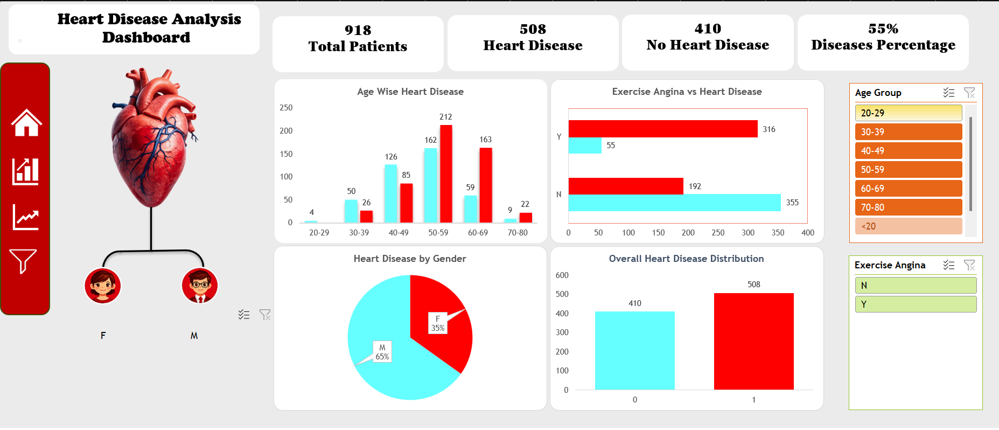

# Heart Disease Analysis Dashboard

## 📊 Dashboard Preview

This Data Analyst project analyzes 918 patient records to identify key patterns and factors influencing heart disease using Microsoft Excel.

## 🔹 Key Features
- Interactive KPI dashboard
- Age-wise, Gender-wise analysis
- Correlation Matrix
- Dynamic visualizations

## 🛠 Tools Used
- Microsoft Excel
- Pivot Tables
- Data Analysis ToolPak
- Charts & Slicers
